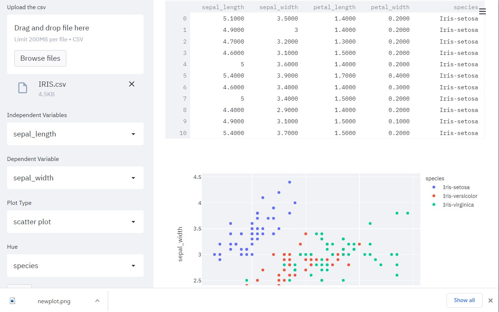
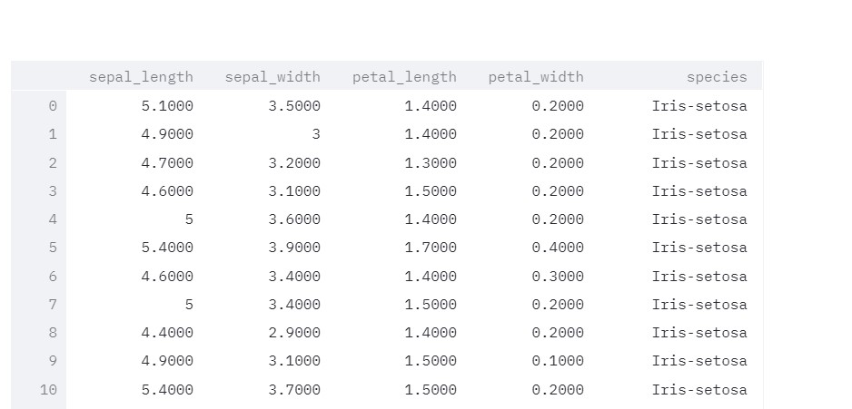
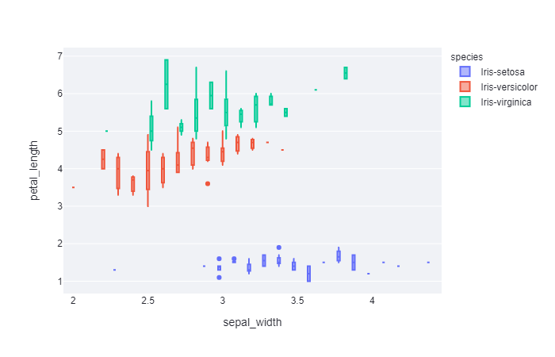

# Streamlit

  Streamlit is a framework used to create interactive web application especially for Data Analysis and machine learning. It is built on reactJS. We can easily integrate other python libraries such as seaborn, plotly etc. It can provide very attractive UI/UX application. The video of the working model is [here](https://www.linkedin.com/posts/annamalai-v-r-830381180_datascience-linearabrregression-eda-activity-6795023624479891456-YUS5).
  
  # Dashboard
  
  # Dataset  
  
  # Plots
  
